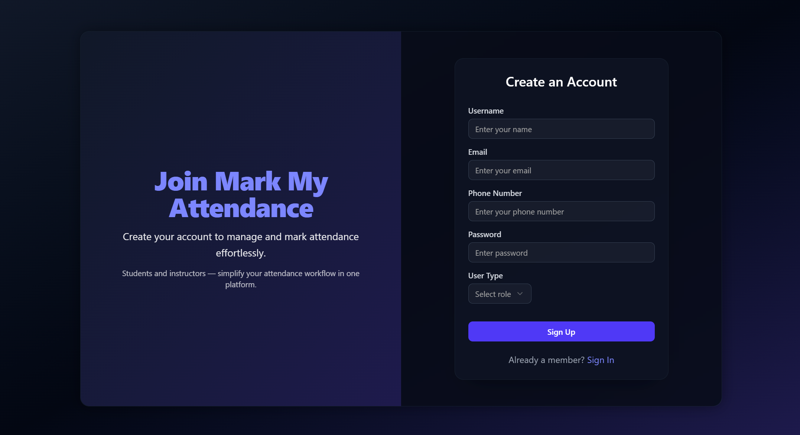
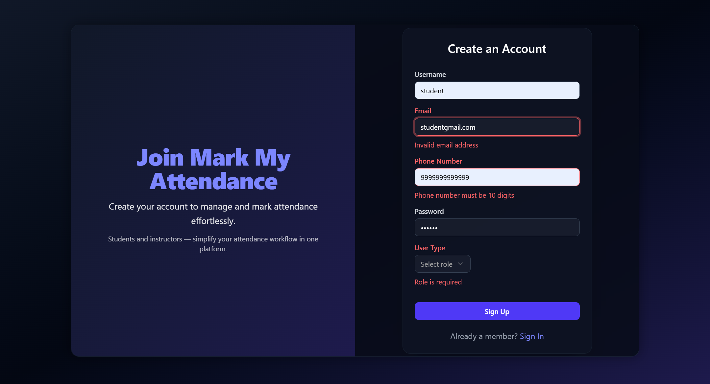

# 📊 MERN Attendance Tracker

A minimal, full-stack attendance tracking system using IP address verification. Built with MongoDB, Express, React, Redux and Node.js (MERN), this app helps instructors track student presence in online/offline mode via IP address.

---

## 📋 Table of Contents

1. [Features](#-features)
2. [Tech Stack](#-tech-stack)
3. [Project Structure](#-project-structure)
4. [Prerequisites](#-prerequisites)
5. [Environment Variables](#-environment-variables)
6. [Installation](#-installation)
7. [Usage](#-usage)
8. [Available Scripts](#-available-scripts)
9. [Contributing](#-contributing)
10. [License](#-license)
11. [Contact](#-contact)

---

## 📸 Screenshots

<div align="center" style="margin-bottom: 40px;">
  
  <br><br>
  <em>Instructor Dashboard: Create new sessions, view past sessions, and student records</em>
</div>

<br><br>

<div align="center" style="margin-bottom: 40px;">
  
  
  <br><br>
  <em>Left: Sign Up Form &nbsp;&nbsp; | &nbsp;&nbsp; Right: Validation feedback</em>
</div>

<br><br>

<div align="center" style="margin-bottom: 40px;">
  
  <br><br>
  <em>Student Dashboard: “Mark My Attendance” form with IP-based verification</em>
</div>

<br><br>

<div align="center" style="margin-bottom: 40px;">
  
  <br><br>
  <em>Instructor View: Past session summaries with offline/online/absent counts</em>
</div>

---

## 🚀 Features

* Instructor login with role-based access
* Create and manage class sessions
* Automatic attendance marking via student IP address
* Distinguish between offline (center IP) and online students
* Detailed attendance reports and filtering
* Responsive instructor dashboard

---

## 🛠️ Tech Stack

* **Frontend:** React, Vite, TailwindCSS, ShadCN UI , Redux Toolkit , Zod
* **Backend:** Express.js, Mongoose, JWT Authentication
* **Database:** MongoDB Atlas

---

## 📁 Project Structure

```
Mern_Attendance_project-main/
├── backend/        # Node.js + Express API
│   ├── config/     # Environment and database configuration
│   ├── controllers/# Request handlers and business logic
│   ├── middleware/ # Authentication and IP-check middleware
│   ├── models/     # Mongoose schemas and models
│   ├── routes/     # API routes
│   └── index.js    # Entry point for the server
└── frontend/       # React + Vite frontend
    ├── public/     # Static assets
    ├── src/        # Application source code
    │   ├── api/    # API helper functions
    │   ├── components/ # Reusable UI components
    │   ├── pages/  # Route-based pages
    │   └── utils/  # Utility functions and hooks
    └── vite.config.js
```

---

## 🧩 Prerequisites

* [Node.js](https://nodejs.org/) (v16 or higher)
* [npm](https://www.npmjs.com/) or [yarn](https://yarnpkg.com/)
* A MongoDB Atlas account or self-hosted MongoDB instance

---

## 🔐 Environment Variables

Create `.env` files in both **backend** and **frontend** directories.

### Backend (`/backend/.env`)

```env

PORT=3000
MONGO_URI=your_mongodb_connection_string
ACCIO_IP=::1          # Replace with your center IP (offline check)
JWT_SECRET=your_jwt_secret

```

### Frontend (`/frontend/.env`)

```env

VITE_API_URL=http://localhost:3000

```

---

## ⚙️ Installation

1. **Clone the repository**

   ```bash
   git clone https://github.com/your-username/Mern_Attendance_project-main.git
   ```

cd Mern\_Attendance\_project-main

````

2. **Backend Setup**
   ```bash
cd backend
npm install    
npm run dev      
````

3. **Frontend Setup**

   ````bash
   2. **Backend Setup**
      ```bash
   cd frontend
   npm install    
   npm run dev     
   ````

```

---

## 🧑‍💻 Usage

1. Open the app in your browser: `http://localhost:5173`
2. **Instructor** logs in using registered credentials.
3. **Create** a new class session from the dashboard.
4. Students access the attendance link; the backend checks their IP against `ACCIO_IP` for offline presence.
5. Instructor reviews and can manually add online students if needed.
6. Attendance is calculated and stored in MongoDB.
7. Download or view detailed attendance reports in the dashboard.

---

## 📜 Available Scripts

### Backend
- `npm run dev` 
- `npm test` 

### Frontend
- `npm run dev` 
- `npm run build` 

---

## 🤝 Contributing

1. Fork this repository
2. Create a branch: `git checkout -b feature/your-feature-name`
3. Commit your changes: `git commit -m "Add some feature"`
4. Push to your fork: `git push origin feature/your-feature-name`
5. Open a pull request and describe your changes

---

## 📄 License

This project is licensed under the MIT License. 

## 📫 Contact

- GitHub: [safeer997](https://github.com/safeer997)
- Email: safeeralam997@gmail.com

```
